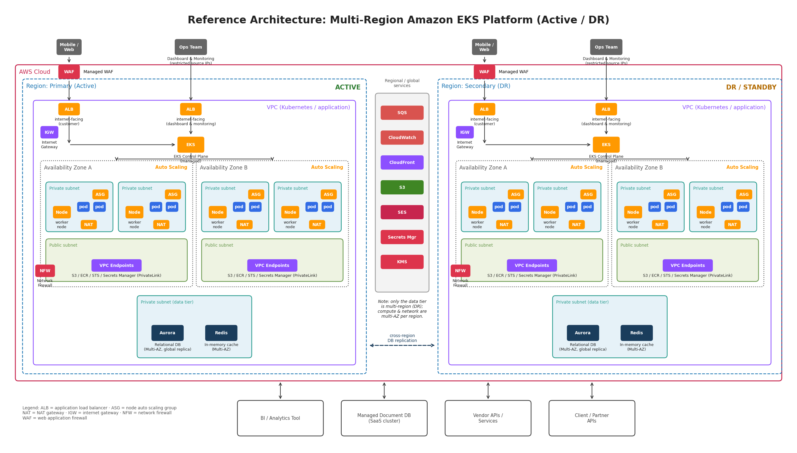

# Building a Resilient Multi-Region Platform on Amazon EKS

*Architecture, autoscaling, security and disaster recovery practices for regulated, customer-facing workloads*

Author: Amit Kumar Jha

Version 1.1, September 2025

Audience: solution architects, platform and DevOps engineers, security reviewers and technical decision makers who are evaluating Kubernetes on AWS.

## Contents
- [1. Executive Summary](#1-executive-summary)
- [2. Design Goals and Guiding Principles](#2-design-goals-and-guiding-principles)
- [3. Architecture at a Glance](#3-architecture-at-a-glance)
- [4. Network Architecture](#4-network-architecture)
- [5. The EKS Cluster](#5-the-eks-cluster)
- [6. Autoscaling: Designing the Chain](#6-autoscaling-designing-the-chain)
- [7. Data Tier](#7-data-tier)
- [8. Security and Compliance](#8-security-and-compliance)
- [9. Observability](#9-observability)
- [10. Resilience and Disaster Recovery](#10-resilience-and-disaster-recovery)
- [11. Delivery: CI/CD and GitOps](#11-delivery-cicd-and-gitops)
- [12. Cost Optimisation](#12-cost-optimisation)
- [13. Best Practices Checklist](#13-best-practices-checklist)
- [14. Conclusion](#14-conclusion)
- [Appendix A. Glossary](#appendix-a-glossary)

## 1. Executive Summary

Customer-facing platforms in banking, fintech and loyalty programmes have a difficult job. Traffic rises and falls sharply with campaigns and month-end cycles. Enterprise clients expect the service to stay up. Regulators treat every design decision as a control that must be documented and proven. Kubernetes has become the standard way to run this kind of workload, and Amazon Elastic Kubernetes Service (EKS) takes away the hardest part by running the control plane as a managed service.

This paper describes a reference architecture for a production EKS platform that runs across two AWS regions in an active and standby pattern. It is based on a real deployment for a large financial services client, with all identifying details removed. Each layer is covered in turn: the edge and network, the EKS cluster, autoscaling at pod and node level, the data tier, security controls, monitoring, and the disaster recovery approach. Along the way the paper lists the practices that kept the platform reliable and ready for audit.

There are three main lessons. First, every stateless layer should run in multiple Availability Zones and scale on its own, while only the data tier needs to be copied across regions. Second, autoscaling is a chain of steps (metrics, pod scaling, node provisioning and application readiness) and a weak link in any one of them stalls the whole system. Third, security controls should be written as infrastructure code and Kubernetes policy so that compliance evidence comes out of normal day to day operations rather than a separate project.

## 2. Design Goals and Guiding Principles

Before drawing a single box, the team agreed a short list of goals. These shaped every later trade-off, so they are worth stating clearly. A reference architecture is only useful when the reader knows what it was built to optimise.

| **Goal**                         | **What it means in practice**                                                                                                                                                       |
|----------------------------------|-------------------------------------------------------------------------------------------------------------------------------------------------------------------------------------|
| High availability                | No single point of failure inside a region. Two Availability Zones (AZs) for every compute and network component, and managed services chosen for their built-in redundancy.        |
| Disaster recovery                | A second region that can take over customer traffic within an agreed Recovery Time Objective (RTO), with data loss limited to a Recovery Point Objective (RPO) measured in seconds. |
| Elasticity                       | Capacity follows demand automatically at both pod and node level. Campaign spikes are absorbed without manual work and idle capacity is released afterwards.                        |
| Defence in depth                 | Several independent security layers (WAF, network firewall, private subnets, IAM, Kubernetes RBAC, encryption) so that the failure of one control does not expose the platform.     |
| Least privilege and auditability | Every person and workload gets the minimum permission needed, and every privileged action leaves a tamper-proof record (PCI DSS Req 7 and 8, ISO 27001 A.5.15 and A.8.15).          |
| Operational simplicity           | Prefer managed AWS services (EKS, Aurora, ElastiCache, Secrets Manager) over self-hosted versions to reduce patching and on-call load.                                              |
| Cost awareness                   | Right-size by default, scale to zero where possible, and make cost visible per team and per environment.                                                                            |

Two principles run through all of these. The first is immutable infrastructure: nodes and containers are never patched in place, they are replaced from a new image. The second is everything as code: VPCs, clusters, IAM policies, Kubernetes manifests and alert rules all live in version control and are applied through pipelines. This is what makes the platform reproducible in a second region.

## 3. Architecture at a Glance

The diagram below shows the reference architecture with client and vendor names removed. The primary region carries all live traffic. The secondary region mirrors the network and compute layout and receives continuous database replication, so it can be promoted if the primary region fails.

*Figure 1. Multi-region EKS reference architecture (active region on the left, DR region on the right).*

Reading the diagram from top to bottom, traffic enters through two controlled paths. Customer traffic from mobile and web clients passes through a managed Web Application Firewall (WAF) and then reaches an internet-facing Application Load Balancer (ALB). The operations team reaches the dashboard and monitoring tools through a second ALB that only accepts connections from the company's known office and VPN IP ranges. Both paths land on the EKS ingress layer.

Inside the VPC, each of the two Availability Zones has private subnets for worker nodes (grouped into Auto Scaling groups), a NAT gateway for controlled outbound access, and a public subnet that holds VPC endpoints and edge components. A separate private data subnet holds the relational database (Amazon Aurora) and the in-memory cache (Amazon ElastiCache for Redis). A network firewall inspects traffic that crosses the VPC boundary. Regional services such as SQS for messaging, S3 for object storage, CloudFront for static content, SES for email, CloudWatch for telemetry, and Secrets Manager and KMS for secrets and keys are reached through private endpoints wherever the service supports them.

Around the edges are the systems the platform talks to: a business intelligence tool, a managed document database delivered as SaaS, vendor APIs and services, and partner APIs.

## 4. Network Architecture

### 4.1 VPC and Subnet Layout

The VPC is split into three tiers of subnets in each AZ. Public subnets hold only the components that must have a public IP: the internet-facing load balancers, NAT gateways and network firewall endpoints. Private application subnets hold the EKS worker nodes and pods. They have no route to the internet gateway and reach the outside world only through the NAT gateway in the same AZ. Private data subnets hold Aurora and ElastiCache. They have no NAT route at all and accept connections only from the application subnets' security groups.

A few sizing rules save trouble later. Give the application subnets a large CIDR range (a /20 or bigger per AZ) because the Amazon VPC CNI gives every pod its own VPC IP address. Running out of IPs is the most common reason pods get stuck in Pending on EKS. Also reserve an address range for the DR region that does not overlap the primary, so the two VPCs can be peered or joined through Transit Gateway when replication or failover tooling needs a private path.

### 4.2 Ingress Paths and Load Balancing

The two entry points are kept separate on purpose so that each can be controlled differently. The customer path is open to the whole internet and therefore carries the strongest protection: a managed WAF with the OWASP Core Rule Set, bot control and rate limiting, followed by an ALB that terminates TLS 1.2 or higher using certificates from AWS Certificate Manager.

The operations path serves dashboards and monitoring tools such as Grafana and the Kubernetes dashboard. It has its own ALB whose security group allows only the company's fixed egress IP ranges, so it is invisible to the public internet even though it is technically an internet-facing load balancer. Every application behind it also requires single sign-on with multi-factor authentication. Keeping this path on a separate ALB means that a WAF rule change or traffic surge on the customer side never affects the team's ability to see what is happening.

Inside the cluster, the AWS Load Balancer Controller creates ALBs directly from Kubernetes Ingress objects. Using IP target mode rather than instance mode lets the load balancer send traffic straight to pod IPs. This removes an extra network hop and makes pod-level health checks accurate.

### 4.3 Egress Control, VPC Endpoints and Network Firewall

Outbound traffic matters as much as inbound on a regulated platform, because both data theft and malware call-backs travel outward. Two controls deal with this. First, VPC endpoints (Gateway endpoints for S3 and DynamoDB, and Interface or PrivateLink endpoints for ECR, STS, Secrets Manager, CloudWatch, SQS and others) keep AWS API traffic on the AWS backbone and off the public internet. This also removes NAT data processing charges for that traffic. Second, AWS Network Firewall sits in front of any traffic that does leave through the NAT gateways and enforces domain allow-lists and Suricata-compatible intrusion detection rules. Together they let the security team state, and prove, exactly which outside destinations the platform can reach.

Security groups are applied at three levels: the load balancers, the node groups, and, through Security Groups for Pods, individual sensitive workloads such as payment-adjacent services. Kubernetes NetworkPolicies, enforced by the VPC CNI's built-in policy engine, then separate traffic between namespaces so that a compromised front-end pod cannot open arbitrary connections to back-end services.

## 5. The EKS Cluster

### 5.1 Control Plane

EKS runs the Kubernetes control plane (API server, etcd, scheduler and controllers) across several AZs in an AWS-managed account. The customer sees a single highly available API endpoint and never patches a master node. For a regulated platform the recommended settings are: private endpoint access only (or public access limited to known CIDRs), all five control plane log types (api, audit, authenticator, controllerManager and scheduler) sent to CloudWatch Logs, and envelope encryption of Kubernetes Secrets with a customer-managed KMS key.

Keep the cluster within one minor version of the latest EKS release. Upgrade the control plane first, then the node groups, then the add-ons, and rehearse each upgrade in the DR region or a staging cluster before touching production.

### 5.2 Worker Nodes and Node Groups

Worker nodes are EC2 instances organised into managed node groups. Each group is backed by an Auto Scaling group that spans the private subnets in both AZs. Nodes run the EKS-optimised Amazon Linux or Bottlerocket image. Bottlerocket is the better choice for security-sensitive workloads because it has a read-only root filesystem, no shell or package manager, and an automated update mechanism.

Rather than one large general-purpose group, the platform uses several groups with specific purposes: a small system group on on-demand instances for CoreDNS, ingress controllers and monitoring agents; a general group for stateless APIs; and a batch group that can tolerate Spot interruptions for queue consumers and scheduled jobs. Taints and tolerations keep workloads on the right group, and topology spread constraints make sure the replicas of each Deployment are spread across both AZs.

### 5.3 Essential Add-ons

| **Add-on**                                     | **Role**                              | **Practice note**                                                                       |
|------------------------------------------------|---------------------------------------|-----------------------------------------------------------------------------------------|
| Amazon VPC CNI                                 | Pod networking with native VPC IPs    | Turn on prefix delegation for higher pod density and enable the network policy feature. |
| CoreDNS                                        | Cluster DNS                           | Run at least 2 replicas across AZs. Use NodeLocal DNSCache for chatty services.         |
| kube-proxy                                     | Service routing                       | Use IPVS mode on large clusters.                                                        |
| AWS Load Balancer Controller                   | Creates ALBs from Ingress objects     | Use IP target type. Annotate for WAF association and access logs.                       |
| EBS and EFS CSI drivers                        | Persistent volumes                    | Encrypt all volumes with a customer-managed KMS key in the default StorageClass.        |
| Metrics Server                                 | Resource metrics for HPA              | Required for CPU and memory based autoscaling.                                          |
| Cluster Autoscaler or Karpenter                | Node autoscaling                      | See Section 6.                                                                          |
| External Secrets Operator or Secrets Store CSI | Sync secrets from AWS Secrets Manager | Never keep secrets in Git or ConfigMaps.                                                |
| cert-manager                                   | In-cluster TLS certificates           | Automates mutual TLS and internal certificates.                                         |

## 6. Autoscaling: Designing the Chain

Autoscaling on Kubernetes is not one feature but a chain of parts that work together. When demand rises, metrics must be collected, the Horizontal Pod Autoscaler must decide to add replicas, the scheduler must find room for them, a node autoscaler must add capacity if there is none, and the new pods must pass readiness checks before the load balancer sends them traffic. Each link has its own delay and its own ways to fail. The sections below take them one at a time.

### 6.1 Horizontal Pod Autoscaler (HPA)

The HPA changes the replica count of a Deployment based on observed metrics. CPU utilisation is the default signal and works well for compute-heavy APIs. A target of 60 to 70 percent leaves enough headroom for the time new pods take to start. For I/O-heavy or queue-driven services CPU is a poor guide, so the platform also scales on custom metrics such as requests per second per pod from the ingress controller, or queue depth from SQS, exposed through the Prometheus Adapter or KEDA.

A few settings matter in practice. Always set both minReplicas (at least 2, spread across AZs) and maxReplicas (limited by downstream capacity such as database connections). Use the behavior field to scale up quickly (for example 100 percent every 15 seconds) but scale down slowly (10 percent every 60 seconds with a 5 minute stabilisation window) so that the replica count does not bounce up and down during bursty traffic.

### 6.2 Node Autoscaling: Cluster Autoscaler versus Karpenter

When the HPA creates pods that cannot be scheduled, a node autoscaler must add capacity. The Cluster Autoscaler does this by raising the desired count of an existing Auto Scaling group. It is mature and predictable, but it is limited to the instance types defined in each group and usually takes two to four minutes to deliver a ready node. Karpenter, an open source project started by AWS, instead launches nodes directly through the EC2 fleet API. It picks the cheapest instance type and purchase option (on-demand or Spot) that fits the pending pods, usually delivers capacity in under a minute, and consolidates under-used nodes on its own.

| **Aspect**           | **Cluster Autoscaler**     | **Karpenter**                                       |
|----------------------|----------------------------|-----------------------------------------------------|
| Provisioning speed   | 2 to 4 minutes             | Usually under 60 seconds                            |
| Instance flexibility | Fixed per node group       | Any type that matches pod requirements              |
| Cost optimisation    | Manual group design        | Automatic bin-packing and consolidation, Spot aware |
| Operational model    | Node groups managed in IaC | NodePool and EC2NodeClass objects in Kubernetes     |
| Maturity             | Very high                  | High and widely adopted. Now part of EKS Auto Mode  |

The reference platform started on Cluster Autoscaler and later moved its general and batch groups to Karpenter, keeping a small managed node group for system components so that Karpenter itself always has somewhere to run. EKS Auto Mode, which bundles Karpenter-style provisioning with managed add-ons and node lifecycle, is a sensible default for new clusters where the team wants AWS to own even more of the operational work.

### 6.3 Vertical Pod Autoscaler and Right-sizing

Horizontal scaling only works if each pod's resource requests are accurate. Requests set too high waste nodes. Set too low, pods are throttled or evicted. The Vertical Pod Autoscaler (VPA) in recommendation mode watches real usage and suggests request values, which are reviewed and committed to the manifests every quarter. Avoid running VPA in automatic mode alongside HPA on the same metric, because the two controllers will work against each other.

### 6.4 Event-Driven Scaling with KEDA

For queue consumers, KEDA (Kubernetes Event-Driven Autoscaling) scales Deployments from zero to many replicas based on SQS queue length, Kafka lag or a cron schedule. This is what lets the batch node group shrink to nothing overnight and grow to dozens of nodes during a bulk crediting run, with nobody touching a dashboard.

### 6.5 Making Scaling Safe

Fast scale-out is useless if scale-in breaks the application. Three Kubernetes features guard against that. PodDisruptionBudgets tell autoscalers and upgrade tools how many replicas may be unavailable at once. Readiness and startup probes make sure the load balancer only routes to pods that can actually serve, and a preStop hook with a matching terminationGracePeriodSeconds gives in-flight requests time to finish. Finally, topology spread constraints and pod anti-affinity keep replicas on different nodes and AZs so that one node termination never removes every copy of a service.

## 7. Data Tier

Only the data tier is copied across regions, and this is a deliberate choice. Compute is cheap to recreate from images and manifests. Data is not. Amazon Aurora (PostgreSQL or MySQL compatible) runs as a Multi-AZ cluster in the primary region with a reader endpoint for reporting queries, and an Aurora Global Database secondary cluster in the DR region receives storage-level replication with a typical lag of under one second. Aurora's automated backups, point-in-time recovery and KMS encryption at rest meet the PCI DSS Req 3 and ISO 27001 A.8.13 expectations for backup and cryptographic protection.

Amazon ElastiCache for Redis provides session and hot-path caching in a Multi-AZ replication group with automatic failover. Cache contents are treated as something that can be rebuilt: the DR region starts with an empty cache and warms up on demand, which keeps the failover procedure simple. Authentication tokens, encryption in transit and at rest are all enabled, and Redis is reachable only from the application subnets.

Two external data systems complete the picture. A managed document database (SaaS) holds flexible-schema catalogue and event data and is connected over PrivateLink or VPC peering, never over the public internet. Vendor services and a business intelligence tool consume data through authenticated APIs and read replicas respectively.

Because these stores hold personal data of loyalty programme members (names, mobile numbers, email addresses and device identifiers), the platform applies data minimisation and purpose limitation controls in line with India's DPDP Act 2023. Personal fields are encrypted at column level where practical, access is logged, and retention schedules are enforced by automated purge jobs.

## 8. Security and Compliance

Security in this architecture is layered so that each control stands on its own. The table below maps the main controls to the framework requirements they support. The paragraphs after it explain the Kubernetes-specific controls in more detail.

| **Layer**            | **Control**                                                                                                                      | **Supports**                                      |
|----------------------|----------------------------------------------------------------------------------------------------------------------------------|---------------------------------------------------|
| Edge                 | Managed WAF (OWASP CRS, bot control, rate limits). TLS 1.2 or higher only.                                                       | PCI DSS 6.4.2, 4.2.1                              |
| Network              | Private subnets, Network Firewall egress allow-list, VPC endpoints, security groups, NetworkPolicies                             | PCI DSS 1.2 to 1.4; ISO 27001 A.8.20 to A.8.22    |
| Identity (people)    | SSO with MFA for AWS and cluster access. IAM roles mapped to Kubernetes RBAC through EKS access entries. No shared accounts.     | PCI DSS 7.2, 8.3, 8.4; ISO 27001 A.5.15 to A.5.18 |
| Identity (workloads) | IAM Roles for Service Accounts or EKS Pod Identity, one role per service                                                         | PCI DSS 7.2.5; ISO 27001 A.8.2                    |
| Secrets              | AWS Secrets Manager with KMS, delivered to pods through the CSI driver, rotated automatically                                    | PCI DSS 8.6.2, 3.6; ISO 27001 A.8.24              |
| Supply chain         | Images built in CI, scanned (ECR enhanced scanning), signed, and admitted only if compliant                                      | PCI DSS 6.3.2, 6.2.4; ISO 27001 A.8.25 to A.8.29  |
| Runtime              | Pod Security Standards (restricted), read-only root filesystem, non-root user, seccomp. GuardDuty EKS Runtime Monitoring.        | PCI DSS 5.2, 11.5; ISO 27001 A.8.7, A.8.16        |
| Logging              | Control plane audit logs, CloudTrail, VPC Flow Logs and application logs, centralised, tamper-proof, kept for at least 12 months | PCI DSS 10.2 to 10.5; ISO 27001 A.8.15            |
| Data                 | Encryption at rest (KMS CMK) and in transit. Field-level encryption for personal data. Retention and purge.                      | PCI DSS 3.5, 4.2; DPDP Act 2023 s.8               |

### 8.1 Identity and Access

Two identity systems must line up: AWS IAM and Kubernetes RBAC. EKS access entries (the replacement for the aws-auth ConfigMap) bind IAM principals to Kubernetes groups declaratively, so a platform engineer's SSO role maps to a namespace-scoped ClusterRole and nothing more. Cluster-admin is reserved for an emergency role whose use pages the security team. For workloads, IAM Roles for Service Accounts (IRSA) or the newer EKS Pod Identity give each Kubernetes ServiceAccount its own IAM role. This removes node-wide credentials and satisfies the least-privilege expectations of PCI DSS Requirement 7.

### 8.2 Secure Software Supply Chain

Every container image is built by CI from a reviewed commit, scanned for vulnerabilities in Amazon ECR, signed with Sigstore Cosign, and recorded with a software bill of materials. An admission controller (Kyverno or OPA Gatekeeper) refuses to run images that are unsigned, come from unapproved registries, run as root, or have no resource limits. This turns the PCI DSS Requirement 6 secure development obligations from paperwork into enforced policy.

### 8.3 Runtime Hardening

Namespaces are labelled with the Pod Security Standard restricted profile, which rejects privileged containers, host networking and dangerous capabilities. Bottlerocket nodes, read-only root filesystems and seccomp profiles limit what an attacker can do after exploiting an application bug. Amazon GuardDuty's EKS Protection reviews audit logs and runtime behaviour for suspicious activity, and findings go to the security operations team through Security Hub.

## 9. Observability

A platform that scales on its own must also be observable on its own. The architecture uses three kinds of signal. Metrics flow from node exporters, kube-state-metrics and application endpoints into Amazon Managed Service for Prometheus and are viewed in Amazon Managed Grafana. The same metrics drive the HPA and KEDA. Logs from every container are collected by Fluent Bit and sent to CloudWatch Logs for retention and compliance, and to a searchable store for developers. Distributed traces are produced by the OpenTelemetry SDK and collected by the AWS Distro for OpenTelemetry, so a slow customer request can be followed across the ingress, several microservices and the database.

Alerting follows the rule of symptoms, not causes. On-call engineers are paged on customer-visible error rate and latency objectives. Cause-level signals such as node pressure or pod restarts feed dashboards and tickets instead. Every alert links to a runbook, and every runbook is tested during game days.

## 10. Resilience and Disaster Recovery

### 10.1 Within a Region: Multi-AZ by Default

Every stateless component runs in at least two AZs: two NAT gateways, two or more nodes per node group spread by topology constraints, at least two replicas per Deployment with anti-affinity, and Multi-AZ Aurora and ElastiCache. Losing an entire AZ therefore cuts capacity by roughly half for a few minutes until autoscaling restores it, but never causes an outage. This is tested every quarter by draining all nodes in one AZ during business hours.

### 10.2 Across Regions: Active and Standby DR

The DR region copies the network and cluster layout through the same infrastructure code, and the same GitOps repository deploys the same application versions to both clusters. In normal operation the DR cluster runs at minimal scale, enough to prove the deployment works and to answer synthetic health checks, while Aurora Global Database keeps the data current. The design accepts a small standing cost in return for an RTO of tens of minutes rather than hours.

Failover is a rehearsed runbook, not an improvisation. The steps are: confirm the primary region is unavailable and declare the incident; promote the Aurora secondary cluster to a standalone primary; scale the DR node groups and Deployments to production replica counts, which Karpenter does in minutes; switch DNS using Route 53 health-check based failover or a manual weighted change; and rotate any region-specific secrets and inform partners whose allow-lists reference the primary region's IPs. Failing back is planned rather than automatic, usually in a maintenance window once the primary region is stable and data has been re-synchronised.

As the note on the diagram makes clear, only the database is multi-region. Everything else is rebuilt rather than replicated. This keeps the DR estate simple and avoids the risk of two regions both believing they are the primary.

## 11. Delivery: CI/CD and GitOps

Infrastructure is defined in Terraform (or AWS CDK) and applied through a pipeline with plan review and policy checks. Application manifests are packaged as Helm charts or Kustomize overlays and reconciled by Argo CD or Flux running in each cluster, so the cluster continuously converges on what Git declares. This has two compliance benefits. Every production change is a reviewed pull request, which satisfies change management controls (PCI DSS 6.5.1). And drift between the primary and DR regions is detected automatically, because both reconcile from the same source.

Deployments use progressive delivery (canary or blue/green through Argo Rollouts) with automatic rollback if error rate or latency objectives are breached during the rollout window. Database schema changes are separated from application releases using expand and contract migrations, so either can be rolled back on its own.

## 12. Cost Optimisation

Elasticity is the biggest lever. Karpenter consolidation, KEDA scale-to-zero for batch work and a nightly scale-down of non-production clusters together cut compute spend noticeably compared with fixed-size node groups. Spot instances for interruption-tolerant workloads, Graviton (ARM) instances for services with multi-architecture images, and Savings Plans that cover the steady baseline complete the compute picture.

Network costs deserve the same attention. VPC endpoints remove NAT data processing charges for AWS API traffic. Keeping service to service calls within one AZ where latency allows (topology-aware routing) reduces cross-AZ transfer. CloudFront in front of static assets lowers origin egress. Finally, Kubernetes cost allocation tooling (Kubecost or AWS Split Cost Allocation Data) attributes spend to namespaces and teams, which turns cost into a number engineers can see and act on.

## 13. Best Practices Checklist

The checklist below condenses the recommendations above. It is meant for architecture reviews and as a starting point for new platform engineers.

| **Area**      | **Practice**                                                                                                                                                                                                                                       |
|---------------|----------------------------------------------------------------------------------------------------------------------------------------------------------------------------------------------------------------------------------------------------|
| Network       | Three-tier subnets per AZ. Private API endpoint. VPC endpoints for all supported AWS services. Network Firewall egress allow-list. Separate ingress paths for customer and operations traffic.                                                     |
| Cluster       | Stay within one minor version of the latest EKS. Enable all control plane logs. KMS envelope encryption of Secrets. Bottlerocket or EKS-optimised AMI. Purpose-specific node groups with taints.                                                   |
| Autoscaling   | Accurate resource requests (VPA recommendations). HPA on CPU plus a business metric. Slow scale-down behaviour. Karpenter or Cluster Autoscaler with headroom. KEDA for queue consumers. PDBs, probes and graceful termination on every workload.  |
| Security      | SSO with MFA. EKS access entries mapped to least-privilege RBAC. IRSA or Pod Identity per service. Secrets Manager through CSI. Signed and scanned images enforced by admission policy. Pod Security restricted profile. GuardDuty EKS Protection. |
| Data          | Multi-AZ Aurora with a Global Database secondary. Encrypted volumes and caches. Field-level encryption of personal data. Automated retention and purge. Tested restores.                                                                           |
| Observability | Prometheus metrics, centralised logs, OpenTelemetry traces. Alerting on service objectives. Runbooks linked from alerts.                                                                                                                           |
| Resilience    | Two AZs everywhere. Quarterly AZ drain test. Documented and rehearsed regional failover. Infrastructure and applications deployed to DR from the same Git source.                                                                                  |
| Delivery      | IaC with policy checks. GitOps reconciliation. Progressive delivery with automatic rollback. Expand and contract schema migrations.                                                                                                                |
| Cost          | Karpenter consolidation. Spot for tolerant workloads. Graviton where possible. Savings Plans for the baseline. Per-team cost allocation.                                                                                                           |

## 14. Conclusion

There is nothing exotic in the architecture described here. It combines well-known AWS building blocks (VPC, EKS, Aurora, ElastiCache, WAF and Network Firewall) with a disciplined set of Kubernetes practices around autoscaling, identity and policy. What makes it work in a regulated, high-traffic environment is how consistently those practices are applied. Every component is multi-AZ, every identity has least privilege, every change is a reviewed commit, and every scaling decision is backed by a metric. Teams adopting EKS can use this paper as a starting template and adjust the DR posture and the depth of security tooling to their own risk appetite and regulatory obligations.

## Appendix A. Glossary

| **Term**  | **Meaning**                                                                                                  |
|-----------|--------------------------------------------------------------------------------------------------------------|
| ALB       | Application Load Balancer, the AWS managed layer 7 load balancer.                                            |
| AZ        | Availability Zone, an isolated group of data centres within an AWS Region.                                   |
| HPA / VPA | Horizontal / Vertical Pod Autoscaler, Kubernetes controllers that adjust replica count or resource requests. |
| IRSA      | IAM Roles for Service Accounts, which binds a Kubernetes ServiceAccount to an AWS IAM role.                  |
| KEDA      | Kubernetes Event-Driven Autoscaling, which scales workloads on external signals such as queue depth.         |
| Karpenter | Open source node provisioner that launches right-sized EC2 capacity for pending pods.                        |
| PDB       | PodDisruptionBudget, which limits how many replicas may be voluntarily disrupted at once.                    |
| RTO / RPO | Recovery Time / Recovery Point Objective, the maximum tolerable downtime and data loss in a disaster.        |
| WAF       | Web Application Firewall, which filters HTTP traffic for attacks such as injection and cross-site scripting. |
