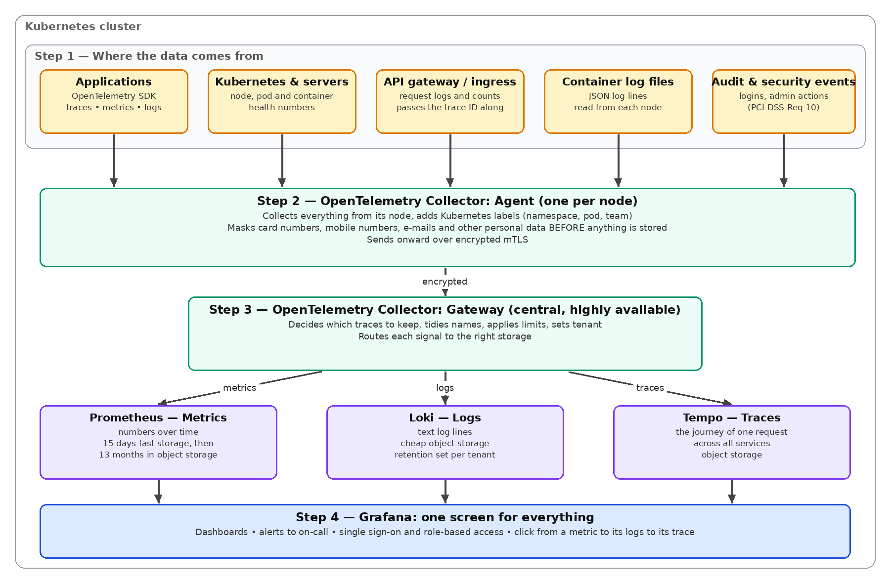

# Observability Made Simple

*Technical whitepaper*

Seeing inside our systems with OpenTelemetry, Prometheus, Loki, Tempo and Grafana on Kubernetes

**Who this is for:** Engineers, architects, SRE leads and technology leadership

**Classification:** Internal reference — Confidential

**Author:** Amit Kumar Jha

**Version:** 1.1 — July 2026

*Versions referenced: Grafana 12.x, Prometheus 3.x, Loki 3.x, Tempo 2.x, OpenTelemetry Collector (contrib). Check the latest releases before you build.*

## Contents

- [1. Summary in one page](#1-summary-in-one-page)
- [2. The three signals, and why they must be linked](#2-the-three-signals-and-why-they-must-be-linked)
- [3. How the platform fits together](#3-how-the-platform-fits-together)
- [4. The tools, one at a time](#4-the-tools-one-at-a-time)
- [5. Alerting that people trust](#5-alerting-that-people-trust)
- [6. Security and compliance](#6-security-and-compliance)
- [7. Cost, sizing and how long we keep data](#7-cost-sizing-and-how-long-we-keep-data)
- [8. Roadmap, maturity and how we measure success](#8-roadmap-maturity-and-how-we-measure-success)
- [9. Things that go wrong, and how we avoid them](#9-things-that-go-wrong-and-how-we-avoid-them)
- [10. Conclusion and next steps](#10-conclusion-and-next-steps)
- [Appendix — Plain-language glossary](#appendix--plain-language-glossary)

## 1. Summary in one page

When something goes wrong in production, the first question is always the same: what is happening, and why? Observability is the practice of collecting enough information from our systems, in the right shape, that we can answer that question quickly — even for problems we never expected.

This paper recommends one shared platform, built from five well-known open-source tools that are designed to work together:

| **Tool**      | **What it does**                                                                               | **In one line**                 |
|---------------|------------------------------------------------------------------------------------------------|---------------------------------|
| OpenTelemetry | Collects the data from applications and servers and ships it onward.                           | The postal service.             |
| Prometheus    | Stores metrics — numbers that change over time (requests per second, error rate, memory used). | The speedometer and fuel gauge. |
| Loki          | Stores logs — the text lines applications write about what they did.                           | The diary.                      |
| Tempo         | Stores traces — the full journey of one request as it passes through many services.            | The GPS route of a single trip. |
| Grafana       | One screen to view all of the above, raise alerts, and control who sees what.                  | The dashboard in the car.       |

The five recommendations, in plain terms:

1.  **Use OpenTelemetry as the one standard.** Applications send data in one format. If we change a storage tool later, no application code changes.

2.  **Mask personal and card data before it is stored.** This happens automatically in the collector, on every node, before any data leaves it.

3.  **Keep label counts small.** The cost and stability of Prometheus and Loki depend on how many unique labels we create, not on how much traffic we have.

4.  **Keep data only as long as the rules require.** Audit logs for twelve months (PCI DSS Req 10.5.1); ordinary application logs for thirty days; traces for a week.

5.  **Roll out in four phases over about six months,** and measure success with a few simple numbers: how fast we detect problems, how fast we fix them, and how many alerts were worth waking someone up for.

> **Why leadership should care**
>
> Faster detection and diagnosis mean smaller, shorter incidents for our clients. One screen that links metrics, logs and traces removes the tool-hopping that slows engineers down during an outage.
>
> Open-source tools with open standards mean no vendor lock-in and a predictable cost line, driven mainly by storage we control.
>
> Audit evidence for PCI DSS, ISO 27001 and the DPDP Act becomes a by-product of everyday operations, not a quarterly fire-drill.

## 2. The three signals, and why they must be linked

Observability data comes in three kinds. Each answers a different question, and each has a home in the platform.

| **Signal** | **Question it answers**                             | **Example**                                                                 | **Stored in** |
|------------|-----------------------------------------------------|-----------------------------------------------------------------------------|---------------|
| Metrics    | How much? How fast? How often?                      | Redemption API error rate rose from 0.1% to 4% at 14:05.                    | Prometheus    |
| Logs       | What exactly happened?                              | "Partner timeout after 5s, order 8821, retry 3 of 3."                       | Loki          |
| Traces     | Where did the time go, and which service caused it? | Of the 6-second request, 5.2 seconds were spent waiting on the partner API. | Tempo         |

On their own, each signal helps. Linked together, they change how fast people work. The link is a small piece of data called a **trace ID**: a unique number given to every request when it first arrives. Every log line written while handling that request carries the trace ID, and every trace is stored under it. In Grafana an engineer can then click on a spike in a graph, see a sample slow request, open its trace to find the slow service, and jump to that service's exact log lines — in under a minute and without typing a single query.

This is why we choose tools from the same family. Prometheus, Loki and Tempo all understand OpenTelemetry natively, share the same label style, and Grafana knows how to connect them.

## 3. How the platform fits together

The diagram below shows the flow from top to bottom. Data is produced at the top, collected and cleaned in the middle, stored in three specialised databases, and viewed through Grafana at the bottom.

*Figure 1 — The observability platform on Kubernetes*

### Step by step

1.  **Produce.** Applications use the OpenTelemetry SDK, or the OpenTelemetry Operator adds it automatically at start-up with no code change. Kubernetes itself, the API gateway and the audit system also produce data.

2.  **Collect and clean.** A small collector runs on every node. It adds useful labels (which namespace, pod and team), masks anything that looks like a card number, mobile number, e-mail or ID number, and sends the data on over an encrypted connection.

3.  **Route.** A central set of collectors decides which traces are worth keeping (all errors and slow requests, plus a sample of the rest), applies limits so no one team can flood the system, and sends each signal to the right store.

4.  **Store.** Prometheus keeps metrics, Loki keeps logs, Tempo keeps traces. All three use cheap object storage (S3-compatible) for anything older than a few days.

5.  **View and alert.** Grafana shows dashboards, evaluates alert rules and pages the on-call engineer. Users sign in with company single sign-on and see only what their role allows.

### Keeping environments apart

Production and non-production data must not live in the same place with the same permissions. We run one platform per security zone (at minimum, production versus everything else) and use Loki and Tempo tenants inside a zone to separate environments and, where a contract demands it, client programmes. The collector sets the tenant based on where the data came from; an application cannot choose its own.

## 4. The tools, one at a time

### 4.1 OpenTelemetry — the standard way to collect

OpenTelemetry (often shortened to OTel) is a vendor-neutral project under the Cloud Native Computing Foundation. It gives us three things: libraries that applications use to produce traces, metrics and logs; a wire format called OTLP for sending them; and the Collector, a small program that receives, processes and forwards data.

What we do with it:

- **Start with automatic instrumentation.** The OpenTelemetry Operator injects the right library for Java, .NET, Node.js, Python or Go when a pod starts. Out of the box we get every HTTP call, database query and message-queue operation, with timings.

- **Add business meaning by hand where it matters.** Points accrual, redemption approval, partner call-outs. Never put a person's name, card number or ID in these fields.

- **Send logs through the same pipe.** The OTel logging bridge adds the trace ID to every log line automatically, so logs and traces line up without developer effort.

- **Run collectors in two layers.** The per-node agent does the light, local work and the masking. The central gateway does the heavier, cluster-wide work such as deciding which traces to keep. Both are plain configuration files kept in Git and reviewed like code.

> **Masking personal and card data — the most important rule**
>
> The collector uses an allow-list: only approved fields pass through, and any value that looks like a card number, Aadhaar-format number, Indian mobile number, e-mail address or access token is replaced with asterisks. We keep a set of test log lines containing fake examples and run them through the configuration every time it changes; if anything gets through, the change is rejected. This single control is what keeps the observability platform out of PCI DSS scope for stored card data and satisfies DPDP data-minimisation.

### 4.2 Prometheus — metrics

Prometheus is the default metrics tool for Kubernetes. It collects numbers from every service every fifteen seconds, stores them as time series, and lets us query them with a language called PromQL. Version 3 accepts OpenTelemetry data directly and adds native histograms, which give us accurate percentiles (for example, the slowest 1 percent of requests) without guessing bucket sizes.

- **Managed by the Prometheus Operator,** so scrape targets and alert rules are Kubernetes resources deployed with the applications.

- **Fifteen days on fast local disk, thirteen months in object storage.** Thanos sits alongside Prometheus to ship data to object storage and summarise old data at five-minute and one-hour resolution so a year-long graph still loads quickly.

- **Pre-computed service-level numbers.** Request rate, error ratio and latency per service are calculated once by recording rules; dashboards and alerts read those, so query load stays predictable.

> **Watch the label count**
>
> Every unique combination of metric name and label values is a separate series in memory. Labels such as pod, namespace or status code are fine. A label carrying a member ID, card token or order number multiplies every metric by the number of members and will exhaust memory. We block such labels at collection time and review the largest metrics monthly.

### 4.3 Loki — logs

Loki stores log lines cheaply because it indexes only a few labels per stream (cluster, namespace, application, environment) and keeps the compressed text in object storage. It is queried with LogQL, which looks like PromQL, so engineers learn one style for both.

- **Simple Scalable mode:** separate read and write components that scale independently, without the operational load of a dozen microservices.

- **Everything in object storage,** with a compactor that deletes data on schedule per tenant — this is how retention rules are enforced.

- **High-cardinality values go in structured metadata, not labels.** Trace IDs, pod names and request IDs are stored alongside each line and can be searched, but they do not create new streams. This is how trace-to-log jumps stay fast and cheap.

- **Accepts OpenTelemetry directly,** so no Loki-specific shipper is needed; the collector decides which fields become labels.

### 4.4 Tempo — traces

Tempo stores traces: the record of one request as it passes through the API gateway, the loyalty service, the database and a partner API, with the time spent in each step. It needs no index database — it stores traces by trace ID in object storage, which makes it inexpensive to run even at high volume.

- **Completes the cycle.** With Tempo, Grafana can go from a metric to a trace (through exemplars — sample trace IDs attached to metrics), from a trace to its logs (through the trace ID in Loki), and from a trace back to metrics for that service.

- **Generates useful metrics itself.** Tempo's metrics generator produces service graphs (who calls whom, how often, how slowly) and per-endpoint latency metrics into Prometheus without any extra instrumentation.

- **Keep the traces that matter.** The gateway collector keeps every trace that has an error or is slower than a threshold, plus about ten percent of the rest. This typically cuts trace storage by five to ten times while losing nothing diagnostically useful.

- **Sequence it after logging is standardised.** Traces are only valuable when every service passes the trace ID along (W3C Trace Context). We enable Tempo once the top services are instrumented, otherwise traces arrive in fragments.

### 4.5 Grafana — one screen

Grafana is where people meet the data. It queries all four stores, draws dashboards, evaluates alert rules and routes notifications to the on-call tool.

- **Single sign-on and role-based access.** Users log in through the company identity provider with MFA; groups map to Grafana roles and teams; local accounts are disabled except one vaulted break-glass administrator. This meets PCI DSS Req 7.2 (need-to-know) and Req 8.3–8.4 (strong authentication and MFA).

- **Dashboards and alerts as code.** They are stored in Git and deployed automatically. Changes are pull requests, so they are reviewed and traceable.

- **Few, good dashboards.** A platform health dashboard, a standard per-service dashboard generated from a template, and a business view (accrual and redemption volumes, partner success rates) for leadership.

- **Audit trail.** Grafana's own audit log — who viewed or changed what — is shipped into a restricted Loki tenant that only the security team can read.

## 5. Alerting that people trust

The most common failure of observability programmes is not missing data but too many alerts. When engineers receive dozens of pages that need no action, they stop reading them. We fix this by alerting on what customers feel, not on internal thresholds.

For each customer-facing service we agree a **service level objective (SLO)** — for example, 99.9 percent of redemption requests succeed within one second, measured over thirty days. The 0.1 percent we are allowed to miss is the **error budget**. Alerts fire when the budget is being spent too fast:

| **Alert level** | **Meaning**                                                     | **Who is told**               | **Example**                                |
|-----------------|-----------------------------------------------------------------|-------------------------------|--------------------------------------------|
| Page            | At this rate the whole month's budget is gone in a day or less. | On-call engineer, immediately | 5% of budget spent in the last hour        |
| Ticket          | Budget is leaking; fix it this week.                            | Team backlog                  | 10% of budget spent in the last three days |
| Dashboard only  | Interesting but not urgent (CPU, disk, queue depth).            | Nobody is paged               | Node CPU at 85%                            |

Every alert rule must carry a team, a severity and a link to a runbook, and a monthly review retires any rule where fewer than seven in ten pages led to real action.

## 6. Security and compliance

The platform holds copies of operational data from every system, so it is both a security control and something to protect. The table maps the main obligations to how the design meets them; control numbers should be checked against the current standard versions before an audit.

| **Requirement**                | **What it asks**                                                                           | **How we meet it**                                                                                               |
|--------------------------------|--------------------------------------------------------------------------------------------|------------------------------------------------------------------------------------------------------------------|
| PCI DSS v4.0.1 Req 10.2–10.3   | Record user access, admin actions and authentication events; protect logs from tampering.  | Audit events flow to a restricted Loki tenant; object storage has write-once locking; only Security can read it. |
| PCI DSS Req 10.4               | Review logs daily.                                                                         | Automated alerts on suspicious patterns plus a daily review dashboard with sign-off recorded.                    |
| PCI DSS Req 10.5.1             | Keep audit logs 12 months; last 3 months instantly available.                              | Audit tenant: 90 days fast storage, 400 days total.                                                              |
| PCI DSS Req 10.7               | Detect failure of security controls.                                                       | The platform monitors itself: collector, storage and alerting failures page the platform team.                   |
| PCI DSS Req 3.3–3.4            | Never store sensitive card data; mask PAN.                                                 | Masking in the collector before storage; automated leakage tests on every change.                                |
| PCI DSS Req 6.2 / 6.5          | Secure development and change control.                                                     | Collector, alert and dashboard configuration goes through pull request, review and CI checks.                    |
| PCI DSS Req 7 and 8            | Need-to-know access; unique IDs and MFA.                                                   | SSO with MFA; role-based access in Grafana; per-team folders and tenants.                                        |
| ISO 27001:2022 A.8.15 / A.8.16 | Logging and monitoring.                                                                    | This platform is the primary implementation; runbooks and review records are the evidence.                       |
| DPDP Act 2023 / ISO 27701      | Collect only necessary personal data; keep it no longer than needed; be able to delete it. | Allow-list masking; 30-day retention for application logs; Loki deletion API for targeted erasure.               |
| RBI expectations               | Monitor critical systems; keep data in-country; control third-party components.            | Self-hosted in the region we choose; images scanned and pinned; advisories tracked.                              |

Protecting the platform itself: all connections use mutual TLS; network policies allow only the intended paths (agent to gateway, gateway to stores, Grafana to stores); secrets come from the secrets manager, never from Git; images are pinned and scanned, and Grafana is patched within days of a critical advisory because it is the door to all of this data.

## 7. Cost, sizing and how long we keep data

Cost depends on three things: how many unique metric series we have, how many gigabytes of logs and traces we take in per day, and how many people query at once. The first is controlled by label discipline; the second by retention and sampling. The table gives the recommended retention; the figures below it size a first production deployment.

| **Data**                    | **Fast storage** | **Total kept**          | **Why**                                                        |
|-----------------------------|------------------|-------------------------|----------------------------------------------------------------|
| Audit and security logs     | 90 days          | 13 months               | PCI DSS Req 10.5.1; RBI and client contracts                   |
| Production application logs | 14 days          | 30 days                 | Enough to debug; short because lines may contain personal data |
| Non-production logs         | 7 days           | 7 days                  | Cost only                                                      |
| Metrics, full detail        | 15 days          | 30 days                 | Incident analysis                                              |
| Metrics, summarised         | —                | 13 months               | Capacity planning, year-on-year views                          |
| Traces                      | 7 days           | 30 days for errors only | Value fades quickly                                            |

For a production cluster of about 60 nodes, 1,500 pods, 1.5 million active metric series and 150 GB of raw logs a day, plan for: two Prometheus replicas (8 vCPU, 16 GB each, 500 GB SSD); three Loki writers and three readers (2–4 vCPU, 8 GB each); two Tempo ingesters and two queriers (2 vCPU, 4 GB each); three gateway collectors (2 vCPU, 4 GB); an agent on each node (0.5 vCPU, 1 GB); two Grafana replicas with a small PostgreSQL. Object storage grows about 35–50 GB per day across all signals and settles around 5–7 TB under the retention above — a low five-figure annual storage bill in US-dollar terms. Compute, mostly Prometheus memory and Loki readers, is the bigger line. Treat these as pilot-sizing numbers and measure.

To keep cost visible: publish per-team volume dashboards, set soft quotas per tenant, and review the twenty largest metrics and log streams each quarter.

## 8. Roadmap, maturity and how we measure success

The tools are the easier half. The harder half is changing habits: how teams write logs, define alerts and respond. A platform team of two or three engineers builds the platform; application teams then own their own dashboards, SLOs and alerts within templates the platform team provides.

| **Phase**              | **When**    | **What we do**                                                                                                              | **Done when**                                                         |
|------------------------|-------------|-----------------------------------------------------------------------------------------------------------------------------|-----------------------------------------------------------------------|
| 1\. Foundation         | Weeks 1–6   | Deploy Prometheus, Loki, Grafana with SSO and Git-based provisioning; collectors with masking; platform dashboards.         | Cluster metrics and container logs visible; masking tests pass.       |
| 2\. Applications       | Weeks 6–14  | Auto-instrument the top ten services; JSON logging standard; standard service dashboards; first SLOs for two customer APIs. | Trace ID present end-to-end on two flows; legacy alerts consolidated. |
| 3\. Compliance         | Weeks 12–18 | Restricted audit tenant with write-once storage; retention enforced; daily review dashboard; evidence pack.                 | Internal audit dry-run passes; access review done.                    |
| 4\. Complete the cycle | Weeks 18–26 | Enable Tempo and metric-to-trace-to-log links; long-term metrics with Thanos; cost governance; switch off old tools.        | Old monitoring retired; MTTR improving quarter on quarter.            |

### Maturity ladder

| **Level**        | **What it looks like**                                                                               |
|------------------|------------------------------------------------------------------------------------------------------|
| 1 — Reactive     | Server metrics and plain-text logs; we hear about incidents from customers.                          |
| 2 — Instrumented | Structured logs and service metrics; dashboards exist; alerts are noisy.                             |
| 3 — Linked       | Trace IDs everywhere; metrics, logs and traces connected in Grafana; alerts have runbooks.           |
| 4 — SLO-driven   | Every customer-facing service has an SLO; paging is based on error budget; cost per team is visible. |
| 5 — Optimising   | Telemetry drives capacity, cost and product decisions; the platform meets its own SLOs.              |

Most organisations begin at level 1 or 2. This roadmap reaches level 3 by the end of phase 2 and level 4 by the end of phase 4.

### Numbers for leadership

| **Measure**                | **Meaning**                                                   | **Target after phase 4**                      |
|----------------------------|---------------------------------------------------------------|-----------------------------------------------|
| Time to detect             | From fault to first alert                                     | Under 5 minutes for customer-impacting faults |
| Time to resolve            | From alert to service restored                                | 30% lower than today                          |
| Alert precision            | Share of pages that needed action                             | Above 70%                                     |
| Instrumentation coverage   | Share of production services sending OTel data with trace IDs | Above 90%                                     |
| Data-leak events           | Personal or card data found in telemetry                      | Zero, with quarterly sampling as evidence     |
| Telemetry cost per service | Monthly storage and compute per service                       | Within budget; no unbounded growth            |

## 9. Things that go wrong, and how we avoid them

| **Risk**                           | **What happens**                                        | **Our answer**                                                                               |
|------------------------------------|---------------------------------------------------------|----------------------------------------------------------------------------------------------|
| Too many unique labels             | Prometheus runs out of memory; Loki slows; cost climbs. | Block risky labels at collection; monthly review; identifiers go in log content, not labels. |
| Personal or card data stored       | PCI and DPDP breaches; audit findings.                  | Allow-list masking; automated tests; quarterly sampling.                                     |
| Collector fails during an incident | We lose data exactly when we need it.                   | Disk-backed queues; highly available gateway; the platform monitors itself.                  |
| Dashboard and alert sprawl         | Nobody trusts them; pages are ignored.                  | Everything as code; templates; alert-precision target.                                       |
| Platform 'finished' after phase 1  | Old habits stay; value never arrives.                   | Teams own their instrumentation; adoption numbers on the engineering scorecard.              |
| Unpatched Grafana or collector     | Attackers reach all our operational data.               | Pinned images, scanning, patch within days for critical issues.                              |

## 10. Conclusion and next steps

This stack is mature, widely used and well within our ability to run ourselves. The technical risks are manageable; the real work is in discipline around labels, masking and SLO-based alerting. The immediate asks are: approve a platform team of two to three engineers for two quarters; pick two customer-facing flows as the pilot; agree the retention table in section 7 with Security and Compliance; and put the measures in section 8 on the engineering scorecard so progress is visible to everyone.

## Appendix — Plain-language glossary

| **Term**           | **Meaning**                                                                                                      |
|--------------------|------------------------------------------------------------------------------------------------------------------|
| Telemetry          | The collective name for metrics, logs and traces emitted by a system.                                            |
| Trace ID           | A unique number given to a request when it arrives; carried through every service and every log line it touches. |
| Span               | One step inside a trace, for example a single database call, with its start time and duration.                   |
| Exemplar           | A sample trace ID attached to a metric, letting you jump from a graph to a real request.                         |
| Cardinality        | How many unique label combinations exist. High cardinality means high memory and cost.                           |
| SLO / error budget | The reliability target we promise, and the small amount of failure we are allowed before we must act.            |
| Tenant             | A separate compartment inside Loki or Tempo with its own data, limits and retention.                             |
| Object storage     | Cheap, durable cloud storage for files (S3-compatible); used for anything older than a few days.                 |
| Tail sampling      | Deciding whether to keep a trace after seeing all of it, so errors and slow requests are always kept.            |
| OTLP               | The OpenTelemetry Protocol — the standard format for sending telemetry.                                          |
