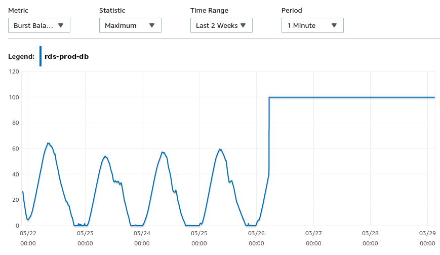
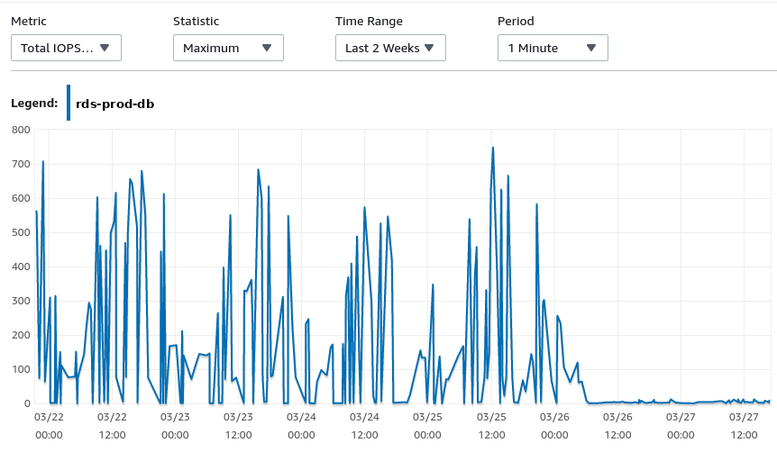

# The Silent Performance Killer

## Understanding, Detecting and Preventing Burst-Balance Exhaustion on AWS gp2 Storage

**Whitepaper** · Amit Kumar Jha · Revised edition, April 2022

---

> **Abstract**
>
> Production databases and servers on AWS sometimes freeze for minutes at a time with no error, no crash and no log entry. In a surprising number of cases the culprit is not the application at all but the storage beneath it: a General Purpose SSD (gp2) volume that has quietly spent its burst credits and been throttled back to a tiny baseline. This paper explains how the gp2 credit model works, how to recognise exhaustion from CloudWatch, and walks through a real production RDS incident in which a 50 GiB volume stalled every night for a week. It closes with a practical detection and remediation playbook.

---

## Contents

- [Executive Summary](#executive-summary)
- [1. Introduction: The Outage That Leaves No Trace](#1-introduction-the-outage-that-leaves-no-trace)
- [2. How gp2 Performance Really Works](#2-how-gp2-performance-really-works)
  - [2.1 IOPS, the currency of storage](#21-iops-the-currency-of-storage)
  - [2.2 The credit bucket](#22-the-credit-bucket)
  - [2.3 Where the arithmetic bites](#23-where-the-arithmetic-bites)
- [3. Symptoms: What Exhaustion Looks Like from the Application](#3-symptoms-what-exhaustion-looks-like-from-the-application)
- [4. Case Study: The Database That Went Silent Every Night](#4-case-study-the-database-that-went-silent-every-night)
  - [4.1 Background](#41-background)
  - [4.2 What CloudWatch showed](#42-what-cloudwatch-showed)
  - [4.3 Resolution](#43-resolution)
- [5. Detection: Making the Invisible Visible](#5-detection-making-the-invisible-visible)
  - [5.1 The metrics to watch](#51-the-metrics-to-watch)
  - [5.2 Alarming before it hurts](#52-alarming-before-it-hurts)
  - [5.3 A five-minute triage checklist](#53-a-five-minute-triage-checklist)
- [6. Remediation and Prevention](#6-remediation-and-prevention)
  - [6.1 Immediate remedies](#61-immediate-remedies)
  - [6.2 Reduce the demand](#62-reduce-the-demand)
  - [6.3 Build it into the process](#63-build-it-into-the-process)
- [7. Conclusion](#7-conclusion)
- [Appendix A: Quick Reference](#appendix-a-quick-reference)

---

## Executive Summary

Amazon EBS General Purpose SSD (gp2) is the default and most widely deployed storage type behind EC2 and RDS. Its pricing is attractive because you pay for capacity, not for guaranteed I/O. Performance is instead governed by a credit system: a volume earns 3 I/O credits per second for every GiB of provisioned capacity, banks up to 5.4 million of them, and may spend them to burst as high as 3,000 IOPS.

The trade-off is rarely understood until it hurts. When a workload consistently consumes I/O faster than the volume earns credits, the balance drains to zero and the volume is throttled to its baseline, which for a 50 GiB volume is a mere 150 IOPS. Applications experience this as stalls, connection-pool exhaustion and timeouts, yet nothing in the application or database logs points at the disk. It is, quite literally, a silent performance killer.

**Key takeaways for engineering and operations teams:**

- **Size gp2 volumes for IOPS, not just for gigabytes.** Capacity and performance are coupled: a small volume is a slow volume.
- **Alarm on BurstBalance.** A CloudWatch alarm at 40 % gives you time to act; waiting for 0 % gives you an outage.
- **Correlate IOPS against baseline.** If sustained ReadIOPS + WriteIOPS exceeds 3 × volume-size-in-GiB, exhaustion is not a risk, it is a schedule.
- **When logs are empty, look at the disk.** Unexplained freezes with no application errors should trigger a storage review before a code review.

## 1. Introduction: The Outage That Leaves No Trace

Most performance incidents announce themselves. A memory leak shows in heap graphs, a bad query shows in the slow-query log, a saturated CPU shows in load average. Storage throttling on gp2 does none of these things. The operating system still sees a healthy disk; the database still accepts connections; the application still runs. Requests simply take much longer than they should, because every read and write is queuing behind a rate limiter that lives outside your virtual machine.

The effect on a busy relational database is particularly severe. A database spends most of its life waiting on the disk: flushing redo logs, writing dirty pages, reading blocks that are not in the buffer pool. If the disk suddenly offers one twentieth of the throughput it offered a minute ago, transactions pile up, locks are held longer, connection pools fill with waiting sessions, and the application tier begins timing out. From the outside it looks as if the database has hung. From the inside, the database is doing exactly what it is asked to do, only twenty times more slowly.

This paper is written for engineers and operations teams who run workloads on gp2-backed EBS and RDS storage and who want to understand, detect and prevent this failure mode. It assumes familiarity with AWS but no prior knowledge of the burst-credit model.

## 2. How gp2 Performance Really Works

### 2.1 IOPS, the currency of storage

IOPS, or input/output operations per second, is the number of discrete read or write operations a volume can complete each second. Throughput (MB/s) matters for large sequential transfers such as backups, but for transactional databases and application servers IOPS is almost always the binding constraint, because their I/O is small and random.

### 2.2 The credit bucket

Rather than promising a fixed IOPS figure, gp2 gives every volume a credit bucket and three simple rules:

1. **Earn:** the volume accrues 3 I/O credits per second for every GiB provisioned. This accrual rate is also the volume's **baseline** performance. A 50 GiB volume earns 150 credits/s; a 100 GiB volume earns 300 credits/s. AWS applies a floor of 100 IOPS, so volumes smaller than ~33 GiB still get 100.
2. **Spend:** each read or write operation costs one credit. As long as the bucket has credits, the volume may burst to a maximum of 3,000 IOPS regardless of its size.
3. **Bank:** unused credits accumulate up to a ceiling of 5.4 million. A new volume starts with a full bucket.

Two consequences follow directly. First, a volume that is idle most of the time will always have a full bucket and will feel extremely fast whenever it is used, which is why gp2 is such a pleasant default. Second, a volume that is busy most of the time is living on its baseline, and its baseline is set by its size, not by its workload.

### 2.3 Where the arithmetic bites

The numbers in Table 1 show how the credit model behaves for common volume sizes. The drain time assumes a workload pinned at the 3,000 IOPS burst ceiling; the refill time assumes a completely idle volume.

| **Volume size**     | **Baseline IOPS** | **Burst IOPS**         | **Full bucket drains in** | **Empty bucket refills in** |
|---------------------|-------------------|------------------------|---------------------------|-----------------------------|
| 33 GiB or less      | 100               | 3,000                  | ≈ 31 min                  | 15 h                        |
| 50 GiB (case study) | 150               | 3,000                  | ≈ 32 min                  | 10 h                        |
| 100 GiB             | 300               | 3,000                  | ≈ 33 min                  | 5 h                         |
| 334 GiB             | 1,000             | 3,000                  | 45 min                    | 1.5 h                       |
| 500 GiB             | 1,500             | 3,000                  | 60 min                    | 1 h                         |
| 1,000 GiB or more   | 3,000+            | n/a (baseline ≥ burst) | never                     | n/a                         |

*Table 1 – gp2 baseline, burst duration and recovery time by volume size. Drain time = 5.4 M ÷ (3,000 − baseline); refill time = 5.4 M ÷ baseline.*

The asymmetry in the last two columns is the heart of the problem. A 50 GiB volume can be emptied in about half an hour of heavy load but needs ten hours of near-total idleness to recover. In a production system that is busy for most of the day, "ten hours of idleness" never arrives, so the bucket never refills, and every daily peak starts from a worse position than the last.

> **A common misconception**
>
> It is often said that a volume with zero burst balance "stops doing I/O". It does not. The volume is throttled to its baseline rate (3 IOPS per GiB, minimum 100). For a small volume, though, the difference is academic: falling from 3,000 IOPS to 150 IOPS is a 95 % cut in capacity, and a database that needs 600 IOPS to keep up will behave exactly as if the disk had stopped.

## 3. Symptoms: What Exhaustion Looks Like from the Application

Because the throttle is applied below the guest operating system, none of the usual signals fire. What teams typically observe instead is a cluster of indirect symptoms:

- **Periodic stalls with no error.** Requests slow dramatically or time out for a few minutes, then recover on their own once load eases and a few credits accrue.
- **Connection-pool saturation.** Pools report all connections in use, yet the database shows plenty of headroom in connection count. Sessions are not blocked on locks; they are blocked on I/O.
- **Rising DiskQueueDepth and I/O latency.** In CloudWatch, queue depth climbs while IOPS flat-lines at a suspiciously round number that happens to equal 3 × the volume size.
- **Gaps in logs.** Log writers themselves are waiting on the disk, so the interval of the incident is frequently the interval with the least logging, which sends investigators in exactly the wrong direction.
- **Diurnal pattern.** The problem recurs at the same time each day, tracking the business peak, and is worst towards the end of a busy week.

The last two are the tell-tale signs. If a system "goes quiet" with no logs at a predictable hour, storage credits should be the first hypothesis, not the last.

## 4. Case Study: The Database That Went Silent Every Night

### 4.1 Background

A production Amazon RDS instance supporting a customer-facing application was provisioned with 50 GiB of gp2 storage. Capacity was ample: the database occupied well under half of it. The instance had run without incident for months.

Over the course of one week the application team began reporting that the service became unresponsive for stretches of several minutes, most often late at night. Application connection pools showed all connections as busy, yet the RDS console reported the instance as healthy and available. Slow-query logs contained nothing unusual, and the application logs showed only client-side timeouts.

### 4.2 What CloudWatch showed

The RDS BurstBalance metric, plotted over two weeks at one-minute resolution, told the story immediately (Figure 1). The balance rose during the quieter part of each day, peaking at only 50–65 % before the evening peak pulled it back down. Each night it hit 0 % and stayed there for several hours. Those hours were exactly the windows in which the application stalled.



*Figure 1 – RDS BurstBalance (%) over two weeks. Each daily trough to 0 % coincided with reported application stalls. The step to a sustained 100 % on 03/22 follows the storage resize.*

The Total IOPS metric for the same period (Figure 2) confirmed the cause. The 50 GiB volume had a baseline of 150 IOPS, yet the workload regularly demanded 300–750 IOPS, with frequent spikes above 500 IOPS. The volume was spending credits far faster than it could earn them; a full bucket would drain in roughly half an hour at those rates, and the volume never saw the ten idle hours it needed to refill.



*Figure 2 – Total IOPS for the same instance. Sustained demand of 300–750 IOPS against a 150 IOPS baseline. Note the fall in reported IOPS after 03/22: with credits restored, the same work completes in fewer, less fragmented operations.*

### 4.3 Resolution

The remedy was simple once the diagnosis was clear: the allocated storage was increased. On gp2, provisioning more gigabytes directly raises both the baseline IOPS and the rate at which credits accrue. Immediately after the resize the BurstBalance climbed to 100 % and remained there; the nightly stalls stopped and connection-pool saturation disappeared without any change to the application or database configuration.

> **Lesson**
>
> Capacity was never the problem. The instance had plenty of free gigabytes. It was starved of IOPS, and on gp2 the only lever for IOPS is gigabytes. Volumes must be sized for the I/O the workload generates, with headroom for growth, rather than for the data they hold.

## 5. Detection: Making the Invisible Visible

### 5.1 The metrics to watch

AWS exposes everything required to see this problem coming. The following CloudWatch metrics should be on the dashboard of every gp2-backed production system:

| **Metric**                     | **Service** | **What it tells you**                                                                 |
|--------------------------------|-------------|---------------------------------------------------------------------------------------|
| BurstBalance                   | EBS, RDS    | Percentage of I/O credits remaining; the primary early-warning signal.                |
| ReadIOPS + WriteIOPS           | RDS         | Actual demand. Compare the sustained sum against 3 × size-in-GiB.                     |
| VolumeReadOps + VolumeWriteOps | EBS         | Same as above for EC2-attached volumes (per-period counts; divide by period seconds). |
| DiskQueueDepth                 | RDS         | Outstanding I/O requests. Rising queue depth alongside flat IOPS indicates throttling.     |
| ReadLatency / WriteLatency     | RDS         | Per-operation latency. Jumps sharply when the volume is on baseline.                  |
| VolumeQueueLength              | EBS         | EBS equivalent of DiskQueueDepth.                                                     |

*Table 2 – Key CloudWatch metrics for diagnosing gp2 credit exhaustion.*

In the AWS console the quickest check is to open the volume (or RDS instance), select the Monitoring tab and locate the Burst Balance graph. A saw-tooth pattern that touches zero is a confirmed diagnosis.

### 5.2 Alarming before it hurts

The single most valuable control is a CloudWatch alarm on BurstBalance. Recommended thresholds:

- **Warning at 40 %:** notify the on-call channel. There is typically time to act before impact.
- **Critical at 20 %:** page. On a 50 GiB volume under sustained burst, 20 % represents roughly six minutes of credits.

The alarm can be created from the console or with a single CLI call, for example:

```bash
aws cloudwatch put-metric-alarm --alarm-name rds-burst-balance-low \
  --namespace AWS/RDS --metric-name BurstBalance \
  --dimensions Name=DBInstanceIdentifier,Value=<instance-id> \
  --statistic Minimum --period 60 --evaluation-periods 3 \
  --threshold 20 --comparison-operator LessThanThreshold \
  --alarm-actions <sns-topic-arn>
```

For EC2-attached volumes use the AWS/EBS namespace with the VolumeId dimension. Where alarms are managed as code (CloudFormation, Terraform), a BurstBalance alarm should be part of the standard module for any gp2 volume, so that no volume reaches production without one.

### 5.3 A five-minute triage checklist

When a gp2-backed system stalls without explanation:

1. Open BurstBalance for the affected volume. Is it at or near 0 %? If yes, stop investigating the application and go to step 4; otherwise continue.
2. Compute the baseline: 3 × volume size in GiB (minimum 100).
3. Compare sustained ReadIOPS + WriteIOPS (or the EBS Ops counters divided by the period) against that baseline. If demand exceeds baseline for hours at a time, exhaustion is inevitable.
4. Check DiskQueueDepth and latency for the incident window; both will be elevated while IOPS is pinned at baseline.
5. Decide on an immediate remedy (Section 6) and open a capacity-planning action so the fix becomes permanent.

## 6. Remediation and Prevention

### 6.1 Immediate remedies

**Increase the volume size.** This is the fastest fix and the one used in the case study. Both EBS and RDS allow storage to be grown online. Baseline IOPS and credit accrual rise linearly with size, and the new baseline applies as soon as the modification completes. Size for the observed sustained IOPS plus 30–50 % headroom: a workload averaging 600 IOPS needs at least 200 GiB (600 ÷ 3), so provision around 300 GiB. Note that after a resize AWS enforces a cool-down of several hours before the volume can be modified again, so err on the side of generosity.

**Move to Provisioned IOPS (io1).** If the workload needs more than 3,000 IOPS, needs guaranteed latency, or would require an absurd amount of unused capacity to reach the target baseline, io1 removes the credit model entirely. You specify the IOPS you need and pay for them whether or not you use them. This is the right choice for latency-sensitive transactional databases.

### 6.2 Reduce the demand

Storage is not the only lever. Many workloads generate far more I/O than they need to:

- **Right-size the buffer pool or shared buffers.** Every block served from memory is an IOPS that never reaches the disk. On RDS, ensure the instance class has enough RAM for the working set.
- **Fix missing indexes and full scans.** A single unindexed query on a large table can consume hundreds of IOPS per execution.
- **Tame checkpoint and flush behaviour.** Aggressive flushing settings convert small, mergeable writes into many separate ones.
- **Cache at the application tier.** Read-heavy hot paths belong in ElastiCache or an in-process cache, not on the database disk.
- **Schedule batch jobs and backups deliberately.** A nightly report that competes with the evening peak drains the bucket at precisely the wrong moment.

### 6.3 Build it into the process

Preventing recurrence is a matter of process rather than technology:

1. Adopt a sizing rule: no gp2 volume smaller than the size implied by expected sustained IOPS ÷ 3, plus headroom.
2. Make a BurstBalance alarm a mandatory part of the infrastructure template for every gp2 volume.
3. Review BurstBalance trends quarterly alongside CPU and memory. A downward-drifting weekly minimum is a forecast of the next incident.
4. Load-test with production-like I/O patterns and watch BurstBalance during the test, not just response times.
5. Document the baseline IOPS of each production volume in the runbook so the on-call engineer does not have to work it out at 2 a.m.

## 7. Conclusion

The gp2 burst-credit model is a sensible design. It makes the common case, a lightly loaded volume, both cheap and fast, and it does so transparently. The danger lies in that transparency: a volume that is chronically over-driven fails quietly, at the worst possible time, with no evidence in the layers most engineers inspect first.

The defence is equally simple. Understand that on gp2 gigabytes are IOPS. Size volumes for the work they will do rather than the data they will hold. Put a BurstBalance alarm in front of every production volume. And when a system stops responding while the logs stay silent, check the storage credits before anything else. The half-hour that diagnosis takes is far cheaper than a week of nightly outages.

## Appendix A: Quick Reference

| **Item**                         | **Value / formula**                                            |
|----------------------------------|----------------------------------------------------------------|
| Credit accrual (baseline IOPS)   | 3 × volume size in GiB, minimum 100                            |
| Maximum burst                    | 3,000 IOPS (volumes below 1,000 GiB)                           |
| Credit bucket capacity           | 5,400,000 I/O credits                                          |
| Cost per operation               | 1 credit per read or write                                     |
| Time to drain full bucket        | 5,400,000 ÷ (3,000 − baseline) seconds                         |
| Time to refill from empty (idle) | 5,400,000 ÷ baseline seconds                                   |
| Size needed for sustained IOPS N | N ÷ 3 GiB, plus 30–50 % headroom                               |
| Primary alarm metric             | BurstBalance (AWS/EBS and AWS/RDS)                             |
| Suggested alarm thresholds       | Warn < 40 %, critical < 20 %, 3 consecutive 1-minute periods |

*Table 3 – gp2 credit model at a glance.*

*Figures in this paper reflect gp2 behaviour at the time of the original incident. Always confirm current limits against the Amazon EBS and Amazon RDS documentation before making sizing decisions.*
